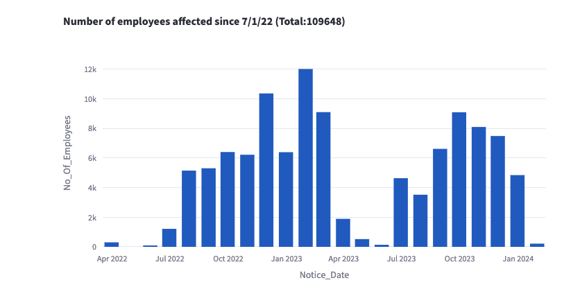

# WARN ACT California Dashboard

## What is the WARN Act?

Worker Adjustment and Retraining Notification (WARN) Act protects employees, their families, and communities by requiring employers to give a 60-day notice to the affected employees and both state and local representatives before a plant closing or mass layoff.
Advance notice provides employees and their families time to transition and adjust to the potential loss of employment, time to seek alternative jobs and, if necessary, time to obtain skills training or retraining to successfully 
compete in the job market.

## What is the WARN Act California Dashboard?

I have created a dashboard to visualize the WARN Act data in California since 2022. 
In this dashboard you can visualize the submitted WARN act notices following views:

- By County
- By Company
- By Month

The dashboard is created using [Streamlit](www.streamlit.io) and the data is sourced from the [California Employment Development Department](https://www.edd.ca.gov/Jobs_and_Training/Layoff_Services_WARN.htm). 

The Dashboard is hosted on [Streamlit Community Cloud](https://alishahed-warn-app-introduction-bbrweg.streamlit.app/)
